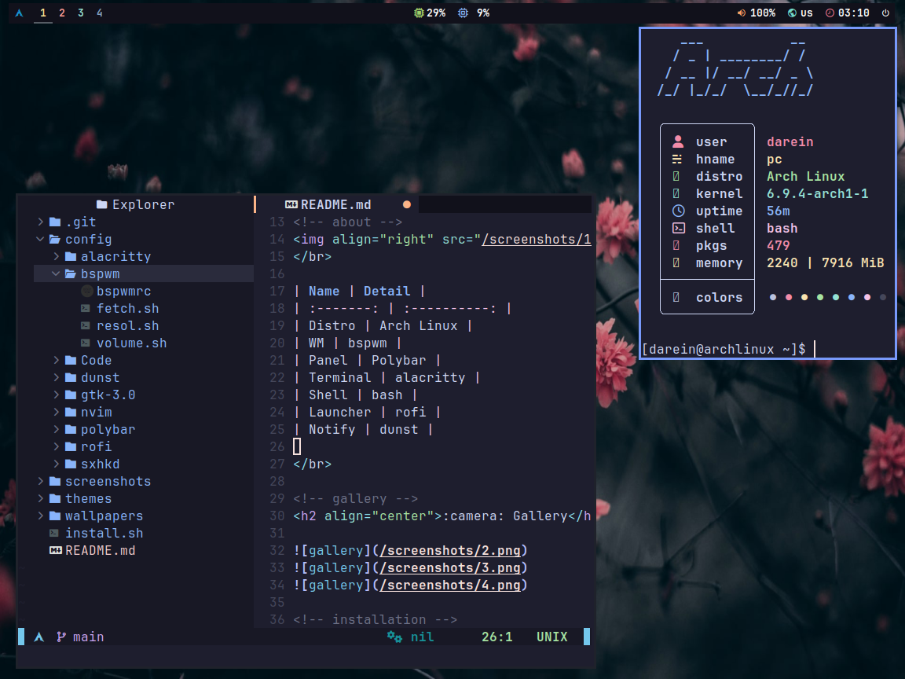

<!-- title -->
<h1 align="center"> :snowflake: BSPWM DOTFILES :snowflake: </h1>

<!-- about -->

</br>
| Name | Detail |
| :-------: | :----------: |
| Distro | Arch Linux |
| WM | bspwm |
| Panel | Polybar |
| Terminal | kitty |
| Shell | zsh |
| Launcher | rofi |
| Notify | dunst |
</br>

<!-- gallery -->
<h1 align="center"> :camera: Gallery </h1>



<!-- installation -->
<h1 align="center"> :floppy_disk: Installation </h1>
```bash
git clone https://github.com/snomfake/bspwm-dotfiles.git && cd bspwm-dotfiles
chmod u+x ./install.sh
./install.sh
```

<!-- warning -->
| :warning: WARNING :warning: |
| :-------------------------: |
| THIS CONFIGURATION IS DESIGNED FOR 1152X864 MONITORS. |
| ALSO BEFORE STARTING THE INSTALLER CHANGE THE **xf86-video-ati** DRIVERS FOR YOUR GPU. |