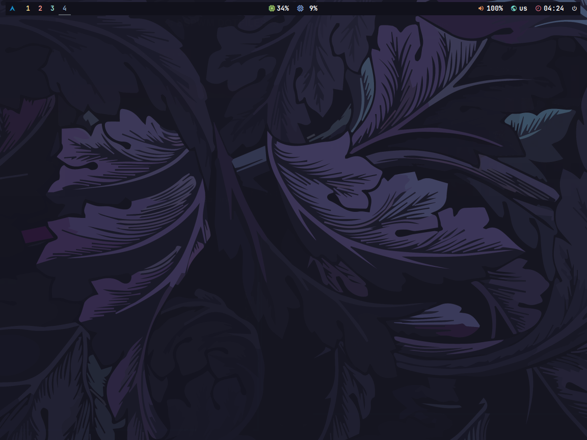

<!-- title -->
<h1 align="center">:snowflake: BSPWM DOTFILES :snowflake:</h1>

<!-- about -->

</br>

| Name | Detail |
| :-------: | :----------: |
| Distro | Arch Linux |
| WM | bspwm |
| Panel | Polybar |
| Terminal | kitty |
| Shell | zsh |
| Launcher | rofi |
| Notify | dunst |

</br>

<!-- gallery -->
<h2 align="center">:camera: Gallery</h2>


<!-- installation -->
<h2 align="center">:floppy_disk: Installation</h2>

```bash
git clone https://github.com/snomfake/bspwm-dotfiles.git && cd bspwm-dotfiles
chmod u+x ./install.sh
./install.sh
```
<!-- warning -->
<table align="center">
   <tr>
      <th align="center">
         <h2>:warning: WARNING :warning:</h2>
      </th>
   </tr>
   <tr>
      <td align="center">
        THIS CONFIGURATION IS DESIGNED FOR 1920X1080 MONITORS.
        ALSO BEFORE STARTING THE INSTALLER CHANGE THE <b>xf86-video-ati</b> DRIVERS FOR YOUR GPU.
   </tr>
</table>
