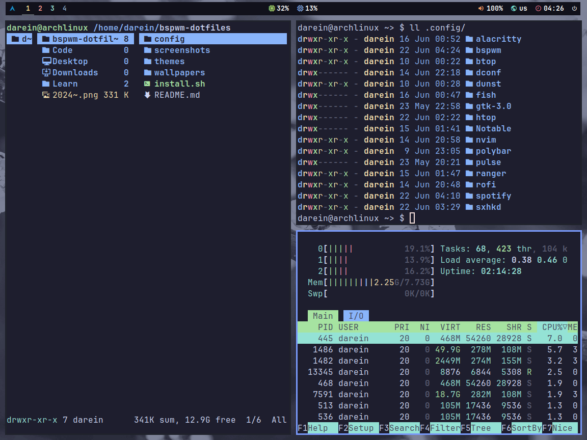

<h1 align="center"> :snowflake: BSPWM DOTFILES :snowflake: </h1>

 

| Name | Detail |
| :-------: | :----------: |
| Distro | Arch Linux |
| WM | bspwm |
| Panel | Polybar |
| Terminal | kitty |
| Shell | zsh |
| Launcher | rofi |
| Notify | dunst |

 

<h1 align="center"> :camera: Gallery </h1>

